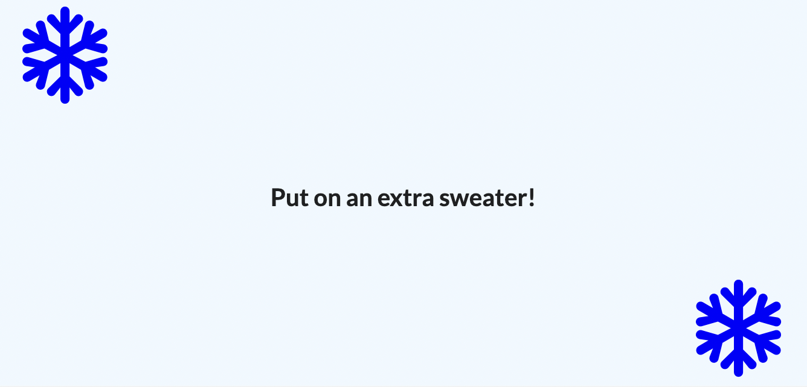

# An app that can tell the current season of the user.

This project was bootstrapped with [Create React App](https://github.com/facebook/create-react-app).

## Table of contents

- [Overview](#overview)
  - [The goal](#the-goal)
  - [Screenshot](#screenshot)
- [My process](#my-process)
  - [Built with](#built-with)
  - [What I learned](#what-i-learned)
  - [Continued development](#continued-development)
  - [Useful resources](#useful-resources)
- [Author](#author)
- [Acknowledgments](#acknowledgments)

## Overview

### The goal

Users should be able to:

- [x] Get advice depending on if they are having summer or winter.
- [x] Have the app load up quickly after permitting geolocation services.

### Screenshot

## My process

- I maintained high contrast ratios (13.1:1, 7.74:1) throughout the website, passing all WCAG tests. Tested using [WebAIM](https://webaim.org/resources/contrastchecker/?fcolor=000000&bcolor=16DFBD).

### Built with

- React

### What I learned

- How to use Create React App.
- How to build content using JSX.
- App lifecycle methods.
- State in React components.
- How to structure apps with function-based components.
- How to structure apps with class-based components.
- How to communicate using props.

### Continued development

The user should be able to see more information based on their geolocation, like local time, weather, temperature.

### Useful resources

- [Semantic UI](https://semantic-ui.com/) - My source for all of my UI components.
- [cdnjs](https://cdnjs.com/) - Enabled me to build an interactive interface.

## Author

- Website - [Coming soon!](#)
- GitHub - [@FredrikRidderfalk](https://github.com/FredrikRidderfalk)
- Twitter - [@Ridderfalk](https://twitter.com/Ridderfalk)

## Acknowledgments

My acknowledgements go out to Stephen Grider and his React course over on Udemy. Enrolling in your course made this project possible. I went from knowing no React to being able to build this project.
